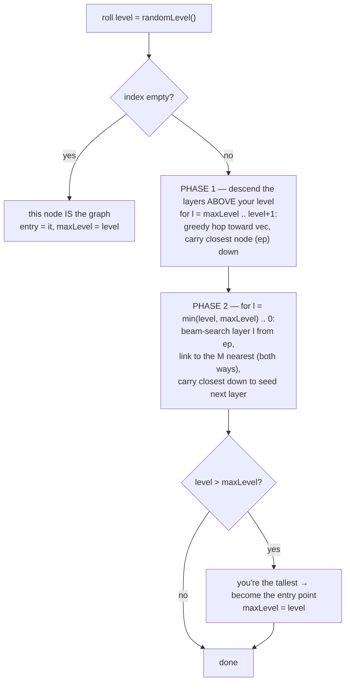
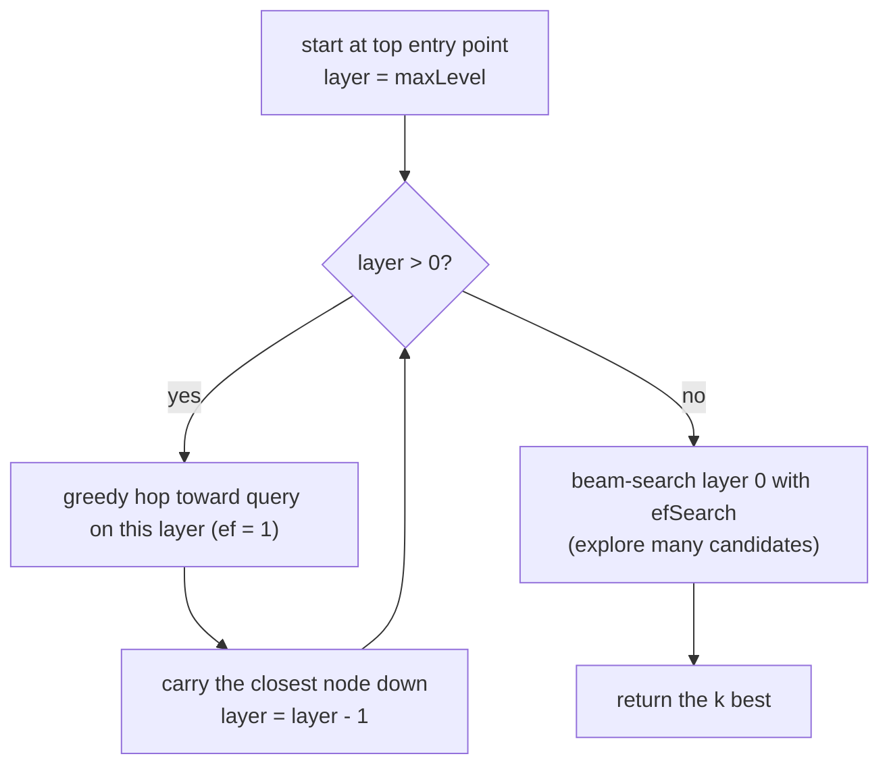

# How Quiver's HNSW index works (a visual guide)

HNSW = **H**ierarchical **N**avigable **S**mall **W**orld. It answers *"which stored
vectors are nearest to this query?"* while looking at only **~log(n)** vectors
instead of all *n*.

---

## 1. The problem it solves

The brute-force ("flat") index compares the query against **every** stored vector:

```
query ──▶ compare to v1, v2, v3, ... , v1,000,000   →  O(n) per query  😵
```

Correct, but at a million vectors every search touches all million. HNSW gets the
same answers touching only a handful — by giving the vectors *structure*.

---

## 2. The core idea: a stack of graphs

Every vector is a **node**. Nodes are linked to their nearest neighbours, forming a
graph you can *navigate* by walking toward the target. The twist: nodes live on a
**random number of layers**, so you get a stack of graphs — sparse on top, dense
at the bottom.

**How tall is each node?** A biased coin flip (`randomLevel`): ~94% of nodes stay on
layer 0, and each higher layer is ~`1/M` as likely. So few nodes are tall:

```
 level 2    █                       █
 level 1    █           █           █           █
 level 0    █     █     █     █     █     █     █     █
            A     B     C     D     E     F     G     H
          (tall) ....................(tall)........
```

**The graph on each layer** — a node only links to others that also reach that layer:

```
 Layer 2    A ─────────────────────────── E          few nodes, LONG hops  (express lanes)
 Layer 1    A ───────── C ───────── E ───────── G     more nodes, medium hops
 Layer 0    A ─── B ─── C ─── D ─── E ─── F ─── G ─── H   EVERY node, short hops (fine detail)
```

`A` and `E` exist on all three layers; `C` and `G` on two; `B, D, F, H` on layer 0
only. Layer 0 always holds **everyone**.

---

## 3. How nodes get wired up (the `M` neighbours)

When a node joins a layer, it connects to its **`M` nearest** nodes on that layer,
and the links go **both ways** (bidirectional). Here a new node **X** joins layer 0
with `M = 2` — it links to the 2 closest existing nodes:

```
        before                          after  (M = 2)

   C ─── D ─── E                    C ─── D ─── E
                                          │╲   ╱
              X (new)                     │ ╲ ╱
                                          │  X        X links to its 2 nearest (D, E)
                                          ╰──┘        and they link back to X
```

Bidirectional matters: a one-way edge would let others reach X but X couldn't walk
out — quietly wrecking recall. (Quiver currently leaves node degree uncapped;
capping it is a later optimisation.)

---

## 4. Inserting a node



**Intuition — "descend to your floor, then wire up on the way down":** a new node
rolls a top floor. On the floors *above* it (Phase 1) it makes no links — it just
uses the sparse express lanes as a fast GPS to get *near* the target region. From
its own floor down to the ground (Phase 2) it actually connects to the `M` nearest
on each layer, handing the closest node down so each layer starts already-close.

### A concrete insert (new node X, rolled level = 1)

```
                    Phase 1: descend layer 2 (X doesn't live here) to get near
 Layer 2    A ━━━━━━━━━━━━━━▶ E            enter at A, greedy-hop toward X → ep = E
                              ┃ drop to layer 1
                              ▼
 Layer 1    A ─── C ─── E ─── G            Phase 2 @ L1: beam from E, link X to M nearest
                       ╲ │ ╱               (say C and E), carry closest down
                        (X)
                         ┃ drop to layer 0
                         ▼
 Layer 0    A─B─C─D─E─F─G─H                Phase 2 @ L0: beam again, link X to M nearest
                     ╲│╱
                     (X)
```

---

## 5. Searching



**Intuition — "big jumps to get near, one wide sweep to get exact":** cheap greedy
hops down the sparse upper layers put you in the right neighbourhood, then a single
`efSearch`-wide beam search on the dense bottom layer finds the true top-k.

### A traced search (query ≈ position of G)

```
 Layer 2   [A]━━━━━━━━━━━━━━▶ E           start at entry A; hop toward query → E
                             ┃ drop
                             ▼
 Layer 1    A ─── C ─── [E]━━▶ G          from E, hop toward query → G
                              ┃ drop
                              ▼
 Layer 0    A─B─C─D─E─F─[G]  ◀── query     from G, ef-wide beam → G + nearby, return top-k
```
Legend:  `[X]` = where you currently are · `━━▶` = greedy hop toward the query ·
`┃`/`▼` = drop to the next layer down.

---

## 6. The three dials

| Dial | When | Effect |
|------|------|--------|
| **M** | build | neighbours per layer — bigger = better recall, more memory |
| **efConstruction** | build | beam width while inserting — bigger = better graph, slower build |
| **efSearch** | query | beam width while searching — **the recall ↔ speed dial**, tunable per query with no rebuild |

Because `efSearch` only controls how much of the *existing* graph a search explores,
you can dial it per query (fast+rough vs slow+precise) without touching the graph.

---

## 7. Why it's ~log(n)

Each layer up holds ~`1/M` the nodes of the one below, so the stack is about
`log_M(n)` layers tall. A search does a cheap greedy hop per upper layer (a handful
of comparisons each) and one wider sweep at the bottom — so total work grows like
**log(n)**, not `n`. That's the whole win: a million-vector search that touches
tens of nodes, not a million.

> Quiver's HNSW is measured against its exact `FlatIndex` (brute force) to report
> **recall** — the fraction of the true nearest neighbours it actually finds — so the
> "approximate" in ANN is always a number you can see, not a mystery.
